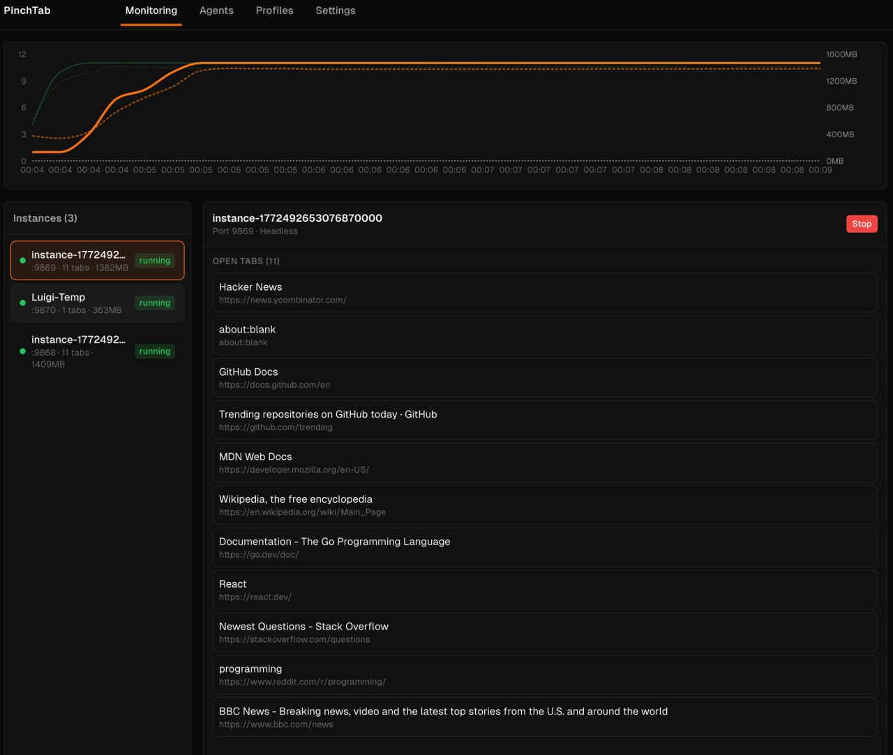

# Memory Monitoring Guide

Pinchtab monitors Chrome's memory usage at the OS level, providing accurate real-world memory consumption for each browser instance.



## Enabling Memory Metrics

Memory monitoring is **off by default** to minimize overhead.

To enable:

1. Open the dashboard at `http://localhost:<port>/dashboard`
2. Go to **Settings** → **📈 Monitoring**
3. Toggle **Tab Memory Metrics** on (marked as experimental)
4. Click **Apply Settings**

## How Memory is Calculated

Pinchtab uses a **process tree approach** to measure memory:

1. **Identify the browser process** — Gets the main Chrome PID from chromedp
2. **Walk the process tree** — Finds all child processes (renderers, GPU, utilities)
3. **Sum RSS memory** — Adds up Resident Set Size across all Chrome processes
4. **Filter renderers** — Counts processes with `--type=renderer` for tab count

This approach ensures memory is **isolated per instance** — you only see memory for that specific Chrome profile, not other Chrome windows on your system.

### Memory Fields

| Field | Description |
|-------|-------------|
| `memoryMB` | Real OS-level memory (RSS) across all Chrome processes |
| `jsHeapUsedMB` | Estimated JS heap (~40% of memoryMB) |
| `jsHeapTotalMB` | Estimated total heap (~50% of memoryMB) |
| `renderers` | Number of renderer processes (≈ tabs) |

> **Note**: JS heap values are estimates based on typical Chrome memory distribution. For exact JS heap metrics, use Chrome DevTools directly.

## API Endpoints

### Per-Tab Metrics

```
GET /tabs/{tabId}/metrics
```

Returns memory metrics (aggregated, since we can't reliably map tabs to PIDs):

```json
{
  "memoryMB": 850.5,
  "jsHeapUsedMB": 340.2,
  "jsHeapTotalMB": 425.25,
  "renderers": 11,
  "documents": 0,
  "frames": 0,
  "nodes": 0,
  "listeners": 0
}
```

### Instance Metrics

```
GET /metrics
```

Returns server metrics and browser memory:

```json
{
  "metrics": {
    "goHeapAllocMB": 12.5,
    "goHeapSysMB": 24.0,
    "goNumGoroutine": 15
  },
  "memory": {
    "memoryMB": 850.5,
    "jsHeapUsedMB": 340.2,
    "jsHeapTotalMB": 425.25,
    "renderers": 11
  }
}
```

### All Instances (Orchestrator)

```
GET /instances/metrics
```

Returns memory metrics for all running instances:

```json
[
  {
    "instanceId": "inst_abc123",
    "profileName": "MyProfile",
    "jsHeapUsedMB": 340.2,
    "jsHeapTotalMB": 425.25,
    "documents": 0,
    "frames": 0,
    "nodes": 0,
    "listeners": 0
  }
]
```

## Dashboard Visualization

When enabled, the Monitoring page shows:

- **Chart**: Solid lines for tab counts (left axis), dashed lines for memory in MB (right axis)
- **Instance List**: Shows memory alongside tab count (e.g., `:9869 · 11 tabs · 1382MB`)
- **Real-time updates**: Data polled every 30 seconds, chart retains ~30 minutes of history

## Performance Considerations

- Memory metrics use [gopsutil](https://github.com/shirou/gopsutil) for OS-level process info
- Minimal overhead: just reads `/proc` (Linux) or uses sysctl (macOS)
- No CDP calls required — works reliably even with many tabs
- 5-second grace period for new instances to stabilize before polling

## Troubleshooting

**Memory shows 0**

- Chrome may not have started yet (check instance status)
- Browser context not initialized

**Memory seems too high**

- Chrome is known to use significant memory
- Each tab runs in a separate renderer process
- Extensions and DevTools add to memory usage

**Memory doesn't match Activity Monitor/Task Manager**

- Pinchtab shows RSS (Resident Set Size) for Chrome processes
- System tools may show different metrics (virtual memory, shared memory)
- Other Chrome windows are excluded — we only count this instance's process tree
